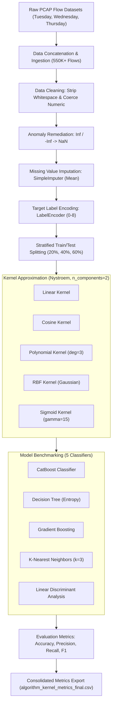

# 🛡️ Network Intrusion Detection System (NIDS) Machine Learning Pipeline

[](https://www.python.org/)
[](https://scikit-learn.org/)
[](https://catboost.ai/)
[](https://pandas.pydata.org/)
[](https://www.unb.ca/cic/datasets/ids-2017.html)
[](https://opensource.org/licenses/MIT)

An end-to-end cybersecurity Machine Learning pipeline for multi-class network traffic anomaly detection and intrusion classification. Built on the benchmark **CICIDS2017** dataset, this repository evaluates data preprocessing, non-linear dimensionality reduction via **Nystroem Kernel Approximation**, and comparative benchmarking across 5 distinct machine learning classifiers across a 75-combination experimental matrix.

---

## 📌 Table of Contents

- [Overview](#-overview)
- [System Architecture & Workflow](#-system-architecture--workflow)
- [Dataset Description (CICIDS2017)](#-dataset-description-cicids2017)
- [Data Preprocessing & Hygiene](#-data-preprocessing--hygiene)
- [Dimensionality Reduction: Nystroem Kernel Approximation](#-dimensionality-reduction-nystroem-kernel-approximation)
- [Classifiers Evaluated](#-classifiers-evaluated)
- [Experimental Matrix & Benchmark Results](#-experimental-matrix--benchmark-results)
- [Key Learnings & Takeaways](#-key-learnings--takeaways)
- [Repository Structure](#-repository-structure)
- [Installation & Setup](#-installation--setup)
- [Running the Pipeline](#-running-the-pipeline)
- [Future Enhancements](#-future-enhancements)

---

## 📖 Overview

Modern corporate and cloud network perimeters face continuous, diverse cyber attacks ranging from brute-force authentication cracking to volumetric Denial-of-Service (DoS) and application-layer web exploits. Human security teams and legacy signature-based Intrusion Detection Systems (IDS) struggle to keep up with the sheer velocity, volume, and polymorphic nature of modern network flows.

This project delivers an automated, reproducible machine learning pipeline (`program.py` and Jupyter notebooks) that:
1. **Aggregates multi-day flow captures** from the CICIDS2017 benchmark dataset (~554,000+ total flow instances).
2. **Cleans real-world telemetry noise**, handling missing metrics and zero-duration calculation anomalies (e.g., infinite flow byte rates).
3. **Applies Nystroem Kernel Approximation** to map 78 high-dimensional network features down to 2 components, evaluating 5 mathematical kernel functions.
4. **Performs an exhaustive benchmark** comparing 5 classifier families across 3 train/test partition sizes (20%, 40%, 60%), resulting in **75 distinct experimental configurations**.
5. **Logs and exports comprehensive performance metrics** (Accuracy, Precision, Recall, F1-Score, and full Confusion Matrices).

---

## 🔄 System Architecture & Workflow



---

## 📁 Dataset Description (CICIDS2017)

The model is trained and benchmarked against the **CICIDS2017** dataset created by the Canadian Institute for Cybersecurity (University of New Brunswick). It contains realistic background benign traffic combined with synchronized, labeled cyberattack vectors.

This project specifically incorporates three major network capture days:

| File Name | Traffic Types & Attack Profiles | Real-World Attack Details |
|---|---|---|
| `Tuesday-WorkingHours.pcap_ISCX.csv` | **FTP-Patator**, **SSH-Patator**, BENIGN | Credential brute-force attacks against network administration ports. |
| `Wednesday-workingHours.pcap_ISCX.csv` | **DoS Hulk**, **DoS GoldenEye**, **DoS slowloris**, **DoS Slowhttptest**, **Heartbleed**, BENIGN | High-volume application-layer Denial of Service attacks and TLS buffer over-read exploits. |
| `Thursday-WorkingHours-Morning-WebAttacks.pcap_ISCX.csv` | **Web Attack - Brute Force**, **Web Attack - XSS**, **Web Attack - SQL Injection**, BENIGN | Common OWASP Top 10 vulnerabilities targeting web applications. |

### Dataset Characteristics:
- **Total Combined Flow Records:** ~554,240 rows
- **Raw Features:** 78 flow parameters extracted using CICFlowMeter (packet inter-arrival times, packet sizes, flow durations, flag counts, header lengths, subflow averages).
- **Target Distribution:** 9 encoded classes with extreme class imbalance:
  - Benign traffic accounts for **~78.1%** of all samples.
  - Common attacks (DoS/DDoS) comprise **~17.5%**.
  - Rare attacks (Heartbleed, SQL Injection, Botnet/Infiltration) comprise **< 0.5%** (e.g., Heartbleed has only 4 instances in the test partition).

---

## 🧹 Data Preprocessing & Hygiene

Real-world network packet flows captured in high-throughput environments contain measurement noise and mathematical anomalies:

1. **Whitespace Trimming:** Column names in raw CSV files often contain trailing/leading spaces (e.g., `' Destination Port '` vs `'Destination Port'`). The pipeline automatically cleans all column headers using `.columns.str.strip()`.
2. **Numeric Type Coercion:** Features are coerced into floating-point representation (`pd.to_numeric(..., errors='coerce')`), safely turning any corrupted network strings into `NaN`.
3. **Handling Division-by-Zero Infinities:** In ultra-fast packet bursts, flow durations can register as `0` microseconds, producing positive and negative infinity (`inf`, `-inf`) for rates like *Flow Bytes/s* and *Flow Packets/s*. The pipeline detects and maps all `inf` values to `np.nan`.
4. **Mean Imputation:** Missing and converted values are imputed via `SimpleImputer(missing_values=np.nan, strategy='mean')`.
5. **Label Encoding:** String labels (`BENIGN`, `DDoS`, `FTP-Patator`, etc.) are transformed to discrete integer classes `[0, 1, 2, ..., 8]` using `LabelEncoder`.
6. **Stratified Splitting:** Splitting is carried out with `stratify=y` to preserve exact relative class frequencies in both training and testing partitions, preventing zero-sample representations of rare attacks like Heartbleed.

---

## ⚡ Dimensionality Reduction: Nystroem Kernel Approximation

Traditional **Kernel PCA** scales quadratically with dataset size ($O(N^2)$ memory to store the Gram matrix and $O(N^3)$ computational time for eigendecomposition). On a dataset of ~550,000 flows:
$$\text{Matrix Size} = 550,000 \times 550,000 \times 8 \text{ bytes} \approx 2.42 \text{ Terabytes of RAM}$$
This makes standard Kernel PCA computationally intractable on standard workstations and Google Colab instances.

### The Nystroem Method
The **Nystroem method** approximates an arbitrary kernel map by sampling a small subset of training instances (components $m=2$), constructing a low-rank approximation of the Gram matrix in linear time $O(m^2 N)$. 

The pipeline benchmarks 5 distinct kernel functions:
- **Cosine Kernel:** Measures the angular cosine similarity between normalized flow vectors on the unit hypersphere.
- **Linear Kernel:** Standard inner-product projection without non-linear mapping.
- **Polynomial Kernel:** Non-linear interaction space ($(\gamma \langle X, Y \rangle + c_0)^d$ with degree $d=3, c_0=1$).
- **RBF (Gaussian Radial Basis Function):** Local similarity mapping based on Euclidean distance ($\exp(-\gamma \|x - y\|^2)$).
- **Sigmoid Kernel:** Hyperbolic tangent mapping ($\tanh(\gamma \langle X, Y \rangle + c_0)$ with $\gamma=15, c_0=1$).

---

## 🤖 Classifiers Evaluated

1. **CatBoost Classifier (`CatBoostClassifier`):**
   - High-performance gradient boosted decision tree library with symmetric tree structures (oblivious trees) that reduce overfitting and accelerate inference.
2. **Decision Tree Classifier (`DecisionTreeClassifier`):**
   - Non-parametric recursive partitioning using Shannon **Entropy** (Information Gain) criterion.
3. **Gradient Boosting Classifier (`GradientBoostingClassifier`):**
   - Sequential ensemble algorithm building successive shallow decision trees to minimize pseudo-residuals.
4. **K-Nearest Neighbors (`KNeighborsClassifier`):**
   - Instance-based non-parametric classifier using $k=3$ nearest neighbors in the 2-dimensional kernel-transformed space.
5. **Linear Discriminant Analysis (`LinearDiscriminantAnalysis`):**
   - Classic generative probabilistic classifier seeking a linear projection maximizing between-class scatter relative to within-class scatter.

---

## 📊 Experimental Matrix & Benchmark Results

The pipeline ran a comprehensive matrix of **75 experiments** across 3 test split ratios ($20\%$, $40\%$, $60\%$), 5 kernel functions, and 5 classifiers.

Below is the verified summary of results compiled in [`algorithm_kernel_metrics_final.csv`](file:///c:/3rd%20semester/Python_Github/algorithm_kernel_metrics_final.csv):

| Algorithm | Kernel PCA | 20% Test Acc | 20% Test F1 | 40% Test Acc | 40% Test F1 | 60% Test Acc | 60% Test F1 |
|---|---|:---:|:---:|:---:|:---:|:---:|:---:|
| **Decision Tree** | **Cosine** | **0.9881** | **0.9881** | 0.9854 | 0.9854 | 0.9822 | 0.9822 |
| **KNN (k=3)** | **Cosine** | **0.9877** | **0.9876** | 0.9751 | 0.9750 | 0.9742 | 0.9742 |
| **Decision Tree** | **Linear** | 0.9862 | 0.9862 | 0.9855 | 0.9854 | 0.9813 | 0.9813 |
| **KNN (k=3)** | **Linear** | 0.9847 | 0.9846 | 0.9676 | 0.9658 | 0.9619 | 0.9603 |
| **Decision Tree** | **Polynomial** | 0.9752 | 0.9752 | 0.9792 | 0.9795 | 0.9806 | 0.9805 |
| **CatBoost** | **Cosine** | 0.9744 | 0.9739 | **0.9768** | **0.9763** | 0.9711 | 0.9703 |
| **Gradient Boosting** | **Cosine** | 0.9720 | 0.9714 | 0.8803 | 0.9022 | 0.9738 | 0.9733 |
| **CatBoost** | **Linear** | 0.9652 | 0.9630 | 0.9707 | 0.9680 | 0.9687 | 0.9662 |
| **KNN (k=3)** | **Polynomial** | 0.9672 | 0.9668 | 0.9575 | 0.9555 | 0.9403 | 0.9387 |
| **CatBoost** | **Polynomial** | 0.9598 | 0.9576 | 0.9650 | 0.9628 | 0.9664 | 0.9629 |
| **Gradient Boosting** | **Linear** | 0.9531 | 0.9503 | 0.9633 | 0.9616 | 0.9613 | 0.9591 |
| **Gradient Boosting** | **Polynomial** | 0.9534 | 0.9510 | 0.9621 | 0.9603 | 0.9577 | 0.9546 |
| **LDA** | **Polynomial** | 0.7810 | 0.6850 | 0.8687 | 0.8425 | 0.8322 | 0.7990 |
| **LDA** | **Linear** | 0.7615 | 0.6908 | 0.8487 | 0.8266 | 0.8481 | 0.8261 |
| *All Classifiers* | **RBF** | 0.7810 | 0.6850 | 0.7810 | 0.6850 | 0.7810 | 0.6850 |
| *All Classifiers* | **Sigmoid** | 0.7810 | 0.6850 | 0.7810 | 0.6850 | 0.7810 | 0.6850 |

---

## 💡 Key Learnings & Takeaways

### 1. The Critical Role of Preprocessing in Network Telemetry
Raw packet captures cannot simply be fed into ML models. Packets transmitted in sub-millisecond intervals cause divide-by-zero errors when computing rate features (e.g. *Bytes/s*). Replacing `inf` values with `NaN` and applying imputation is mandatory to prevent silent pipeline crashes.

### 2. Solving the Big Data Scalability Bottleneck
Full Kernel PCA requires storing a Gram matrix of size $N \times N$, which consumes over 2 Terabytes of RAM on 550K records. Using **Nystroem low-rank kernel approximation** provided a fast, low-memory bridge to map high-dimensional network features into non-linear spaces in seconds.

### 3. The Accuracy Trap & Class Imbalance
In network security, 78% or more of all traffic is benign. As seen in the RBF and Sigmoid runs:
- A model that classifies **every single connection as BENIGN** achieves an apparent **78.10% accuracy**.
- However, its recall on all cyber attack categories is **0.00%**.
- **Takeaway:** Never evaluate an IDS based solely on Accuracy. **Weighted Precision, Recall, and F1-score** are the true indicators of security efficacy.

### 4. Why Cosine & Linear Outperformed RBF & Sigmoid
- Distance-based kernels like **RBF** rely on Euclidean distances ($\|x_i - x_j\|^2$). Because feature attributes had widely varying unscaled magnitudes (e.g., *Flow Duration* in millions of $\mu s$ vs *FIN Flag Count* between $0$ and $1$), the distance was dominated by high-variance features, causing the kernel to collapse into a single cluster.
- Conversely, **Cosine** measures the angular orientation between vectors regardless of magnitude, isolating the structural signature of network attacks regardless of overall packet volume, leading to top scores (**98.81% F1**).

### 5. Transitioning from Notebook to Script
Moving from exploratory notebooks (`Untitled2.ipynb`) to a headless, structured script (`program.py`) required implementing automated path resolution, dynamic error recovery, clean terminal logging, and automated persistence of metrics to CSV.

---

## 📂 Repository Structure

```text
├── Colab_Notebook.ipynb                 # Interactive Google Colab notebook
├── Untitled2.ipynb                      # Development Jupyter notebook with full cell run history
├── program.py                           # Self-contained, executable end-to-end Python ML pipeline
├── algorithm_kernel_metrics_final.csv   # Consolidated 75-combination benchmark comparison table
├── Outputs.txt                          # Complete execution logs and confusion matrices
├── requirements.txt                     # Python package dependencies
└── README.md                            # Comprehensive project documentation
```

---

## 🚀 Installation & Setup

### Prerequisites
- Python 3.8 or higher
- 8 GB+ RAM recommended (for reading multiple large CSV files)

### 1. Clone or Open the Workspace
```bash
cd "c:/3rd semester/Python_Github"
```

### 2. Create a Virtual Environment (Recommended)
```bash
# Windows (PowerShell)
python -m venv venv
.\venv\Scripts\Activate.ps1

# Linux / macOS
python3 -m venv venv
source venv/bin/activate
```

### 3. Install Required Dependencies
```bash
pip install -r requirements.txt
```

---

## 🏃 Running the Pipeline

### Step 1: Obtain the Dataset Files
Place the following three CICIDS2017 CSV files into the project directory (or in `C:\3rd semester\python_programm` / `C:\3rd semester\Python_Github`):
- `Tuesday-WorkingHours.pcap_ISCX.csv`
- `Wednesday-workingHours.pcap_ISCX.csv`
- `Thursday-WorkingHours-Morning-WebAttacks.pcap_ISCX.csv`

> **Note:** The `program.py` script includes an intelligent `resolve_file()` function that automatically searches the current directory and standard project folders for these datasets.

### Step 2: Execute the Script
```bash
python program.py
```

### Step 3: View Outputs
- Detailed terminal outputs will display real-time progress, confusion matrices, and classification reports.
- Upon completion, the script automatically exports a structured summary to `model_results.csv`.

---

## 🔮 Future Enhancements

- [ ] **Feature Scaling (StandardScaler / RobustScaler):** Add robust feature standardizing before Nystroem mapping to evaluate if RBF/Sigmoid performance can be unlocked.
- [ ] **Synthetic Oversampling (SMOTE / ADASYN):** Rebalance extreme minority classes (e.g. Heartbleed with 4 samples, Infiltration with 130 samples) to boost per-class recall.
- [ ] **Higher Embedding Dimensions ($n\_components > 2$):** Benchmark performance scaling when projecting into $d=5, 10, 20$ components.
- [ ] **Deep Learning Models:** Evaluate 1D Convolutional Neural Networks (1D-CNN) or Bi-LSTM architectures on sequential flow features.
- [ ] **Real-Time Packet Ingestion:** Integrate with `scapy` or `pypcap` for live network interface sniffing and instantaneous packet threat classification.

---

## 📜 License
This project is open-source and available under the [MIT License](https://opensource.org/licenses/MIT).
